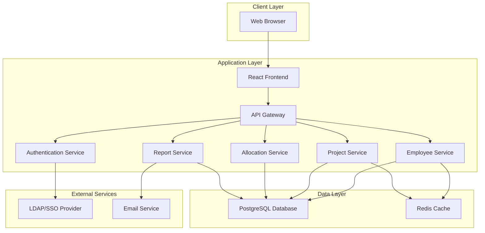
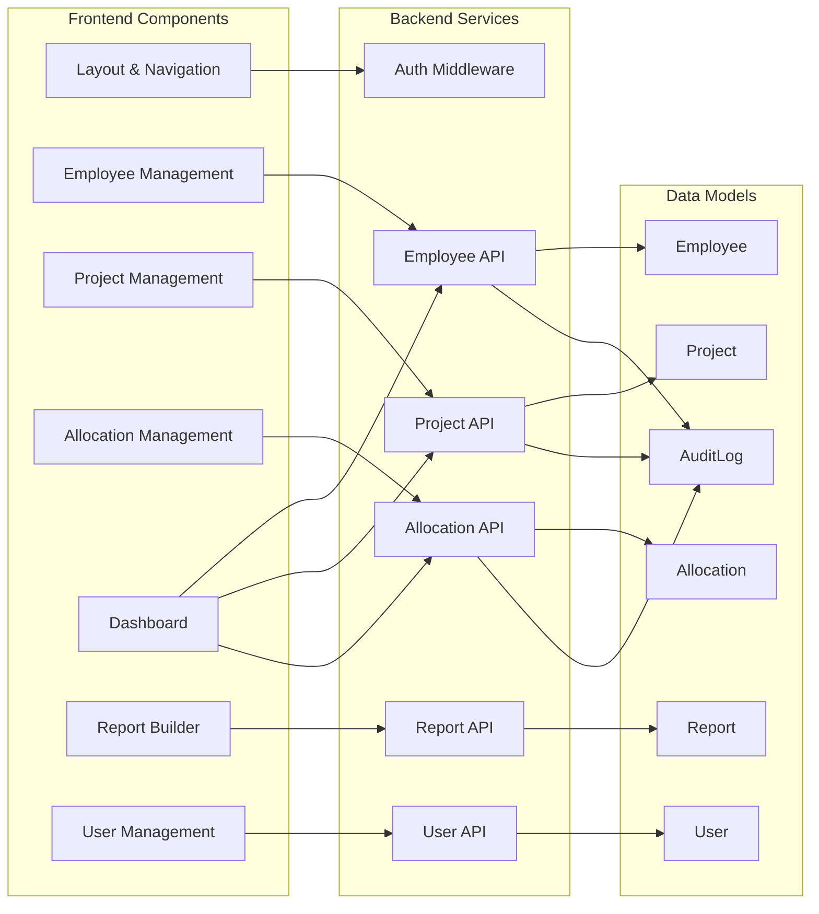
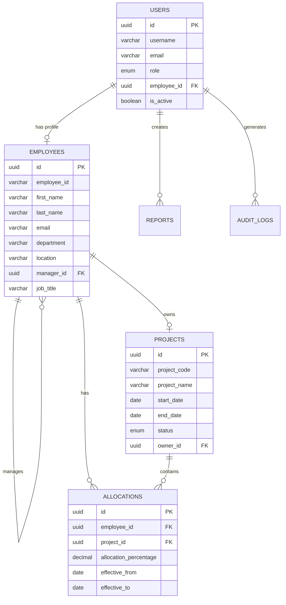

# Headcount Management System - Architecture Plan

## Executive Summary

A web-based headcount management system designed to track employees across multiple projects and geographies with role-based access control, percentage-based project allocation, and custom reporting capabilities.

## System Requirements

### Functional Requirements

#### 1. User Management & Access Control
- **Role-Based Access Control (RBAC)**
  - **Admin**: Full system access, user management, system configuration
  - **HR**: Full access to employee data, reports, and analytics
  - **Manager**: View/edit their team members, view reports for their teams
  - **Employee**: View their own profile and project allocations

#### 2. Employee Management
- **Core Employee Data**
  - Name, Employee ID, Email
  - Department, Location/Geography
  - Manager (hierarchical relationship)
  - Join Date, Employment Status
  
- **Extended Information**
  - Job Title
  - Skills (multi-select/tags)
  - Cost Center
  - Salary Band
  - Performance Rating
  - Certifications

#### 3. Project Management
- Create, update, and archive projects
- Project metadata: Name, Code, Description, Start/End dates
- Project ownership and team assignments
- Geography/location association

#### 4. Allocation Management
- **Percentage-Based Allocation**
  - Employees can be allocated to multiple projects
  - Each allocation has a percentage (e.g., 50% Project A, 30% Project B, 20% Project C)
  - System validates that total allocation = 100%
  - Historical tracking of allocation changes
  - Effective date ranges for allocations

#### 5. Reporting & Analytics
- **Custom Report Builder**
  - Drag-and-drop interface for report creation
  - Filters: Department, Location, Project, Date Range, Employment Status
  - Grouping: By Department, Location, Project, Manager
  - Aggregations: Count, Sum, Average
  
- **Report Scheduling**
  - Schedule reports (daily, weekly, monthly)
  - Email delivery to specified recipients
  - Export formats: Excel, CSV, PDF
  
- **Standard Reports**
  - Headcount by Department/Location/Project
  - Project utilization and allocation summary
  - Employee directory with filters
  - Allocation history and changes

#### 6. Multi-Geography Support
- Support for multiple time zones
- Location-based data organization
- Regional reporting capabilities

### Non-Functional Requirements

#### 1. Security
- SSO/LDAP/Active Directory integration
- Role-based access control at API and UI levels
- Audit logging for all data changes
- Data encryption at rest and in transit
- Session management and timeout

#### 2. Performance
- Support for 1000+ employees
- Fast search and filtering (<2 seconds)
- Report generation within 30 seconds
- Concurrent user support (100+ users)

#### 3. Scalability
- Horizontal scaling capability
- Database optimization for large datasets
- Caching strategy for frequently accessed data

#### 4. Usability
- Responsive design (desktop, tablet, mobile)
- Intuitive UI with minimal training required
- Inline help and tooltips
- Bulk operations support

#### 5. Maintainability
- Clean code architecture
- Comprehensive API documentation
- Automated testing (unit, integration, e2e)
- Version control and CI/CD pipeline

## Technology Stack Recommendation

### Frontend
- **Framework**: React 18+ with TypeScript
  - Component-based architecture
  - Strong typing for maintainability
  - Large ecosystem and community support
  
- **UI Library**: Material-UI (MUI) or Ant Design
  - Pre-built components for rapid development
  - Consistent design system
  - Accessibility built-in
  
- **State Management**: Redux Toolkit or Zustand
  - Centralized state management
  - DevTools for debugging
  
- **Data Fetching**: React Query (TanStack Query)
  - Caching and synchronization
  - Optimistic updates
  - Background refetching

### Backend
- **Framework**: Node.js with Express.js or NestJS
  - JavaScript/TypeScript full-stack consistency
  - NestJS provides better structure for enterprise apps
  - Rich middleware ecosystem
  
- **API Design**: RESTful API with OpenAPI/Swagger documentation
  - Clear API contracts
  - Auto-generated documentation
  - Client SDK generation

### Database
- **Primary Database**: PostgreSQL
  - ACID compliance for data integrity
  - Strong support for complex queries
  - JSON support for flexible fields
  - Excellent performance and scalability
  
- **Caching Layer**: Redis
  - Session storage
  - Frequently accessed data caching
  - Report result caching

### Authentication
- **Library**: Passport.js with LDAP/SAML strategies
  - Multiple authentication strategy support
  - Well-documented and maintained
  - Easy integration with Express/NestJS

### Additional Tools
- **ORM**: Prisma or TypeORM
  - Type-safe database queries
  - Migration management
  - Database schema versioning
  
- **Validation**: Zod or Joi
  - Schema validation
  - Type inference
  
- **Testing**: Jest, React Testing Library, Playwright
  - Unit, integration, and e2e testing
  
- **Build Tools**: Vite (frontend), TypeScript compiler (backend)
  - Fast development builds
  - Hot module replacement

## System Architecture

### High-Level Architecture

### Component Architecture

## Database Schema Design

### Core Tables

#### users
- id (UUID, PK)
- username (VARCHAR, UNIQUE)
- email (VARCHAR, UNIQUE)
- role (ENUM: admin, hr, manager, employee)
- employee_id (UUID, FK to employees)
- is_active (BOOLEAN)
- last_login (TIMESTAMP)
- created_at (TIMESTAMP)
- updated_at (TIMESTAMP)

#### employees
- id (UUID, PK)
- employee_id (VARCHAR, UNIQUE)
- first_name (VARCHAR)
- last_name (VARCHAR)
- email (VARCHAR, UNIQUE)
- department (VARCHAR)
- location (VARCHAR)
- manager_id (UUID, FK to employees)
- job_title (VARCHAR)
- cost_center (VARCHAR)
- salary_band (VARCHAR)
- performance_rating (VARCHAR)
- join_date (DATE)
- employment_status (ENUM: active, inactive, on_leave)
- skills (JSONB)
- certifications (JSONB)
- created_at (TIMESTAMP)
- updated_at (TIMESTAMP)

#### projects
- id (UUID, PK)
- project_code (VARCHAR, UNIQUE)
- project_name (VARCHAR)
- description (TEXT)
- start_date (DATE)
- end_date (DATE)
- status (ENUM: active, completed, on_hold, cancelled)
- location (VARCHAR)
- owner_id (UUID, FK to employees)
- created_at (TIMESTAMP)
- updated_at (TIMESTAMP)

#### allocations
- id (UUID, PK)
- employee_id (UUID, FK to employees)
- project_id (UUID, FK to projects)
- allocation_percentage (DECIMAL)
- effective_from (DATE)
- effective_to (DATE)
- is_active (BOOLEAN)
- created_by (UUID, FK to users)
- created_at (TIMESTAMP)
- updated_at (TIMESTAMP)

#### reports
- id (UUID, PK)
- report_name (VARCHAR)
- report_type (VARCHAR)
- configuration (JSONB)
- schedule (JSONB)
- created_by (UUID, FK to users)
- is_active (BOOLEAN)
- created_at (TIMESTAMP)
- updated_at (TIMESTAMP)

#### audit_logs
- id (UUID, PK)
- user_id (UUID, FK to users)
- action (VARCHAR)
- entity_type (VARCHAR)
- entity_id (UUID)
- old_values (JSONB)
- new_values (JSONB)
- ip_address (VARCHAR)
- timestamp (TIMESTAMP)

### Relationships

## API Design

### Authentication Endpoints
- `POST /api/auth/login` - User login
- `POST /api/auth/logout` - User logout
- `GET /api/auth/me` - Get current user info
- `POST /api/auth/refresh` - Refresh access token

### Employee Endpoints
- `GET /api/employees` - List employees (with filters, pagination)
- `GET /api/employees/:id` - Get employee details
- `POST /api/employees` - Create employee (HR/Admin only)
- `PUT /api/employees/:id` - Update employee (HR/Admin/Manager)
- `DELETE /api/employees/:id` - Deactivate employee (HR/Admin only)
- `GET /api/employees/:id/allocations` - Get employee allocations
- `GET /api/employees/:id/history` - Get employee change history

### Project Endpoints
- `GET /api/projects` - List projects (with filters, pagination)
- `GET /api/projects/:id` - Get project details
- `POST /api/projects` - Create project (HR/Admin only)
- `PUT /api/projects/:id` - Update project (HR/Admin/Owner)
- `DELETE /api/projects/:id` - Archive project (HR/Admin only)
- `GET /api/projects/:id/allocations` - Get project allocations
- `GET /api/projects/:id/team` - Get project team members

### Allocation Endpoints
- `GET /api/allocations` - List allocations (with filters)
- `GET /api/allocations/:id` - Get allocation details
- `POST /api/allocations` - Create allocation (HR/Admin/Manager)
- `PUT /api/allocations/:id` - Update allocation (HR/Admin/Manager)
- `DELETE /api/allocations/:id` - Remove allocation (HR/Admin/Manager)
- `POST /api/allocations/validate` - Validate allocation percentages
- `GET /api/allocations/conflicts` - Check for allocation conflicts

### Report Endpoints
- `GET /api/reports` - List saved reports
- `GET /api/reports/:id` - Get report configuration
- `POST /api/reports` - Create report
- `PUT /api/reports/:id` - Update report
- `DELETE /api/reports/:id` - Delete report
- `POST /api/reports/:id/execute` - Execute report
- `POST /api/reports/:id/schedule` - Schedule report
- `GET /api/reports/:id/export` - Export report (Excel/CSV/PDF)

### User Management Endpoints
- `GET /api/users` - List users (Admin only)
- `GET /api/users/:id` - Get user details
- `POST /api/users` - Create user (Admin only)
- `PUT /api/users/:id` - Update user (Admin only)
- `DELETE /api/users/:id` - Deactivate user (Admin only)
- `PUT /api/users/:id/role` - Update user role (Admin only)

## Security Considerations

### Authentication & Authorization
1. **SSO Integration**
   - SAML 2.0 or OAuth 2.0 with LDAP/Active Directory
   - JWT tokens for API authentication
   - Refresh token rotation
   - Session timeout after 30 minutes of inactivity

2. **Role-Based Access Control**
   - Middleware checks on all API endpoints
   - Frontend route guards
   - Data filtering based on user role and hierarchy

3. **Data Protection**
   - HTTPS only (TLS 1.3)
   - Database encryption at rest
   - Sensitive data hashing (passwords if local auth)
   - Input sanitization and validation

4. **Audit Trail**
   - Log all data modifications
   - Track user actions
   - IP address logging
   - Retention policy (7 years)

## User Interface Design

### Key Screens

#### 1. Dashboard
- Headcount summary cards (total, by department, by location)
- Project allocation overview
- Recent changes feed
- Quick actions (Add Employee, Add Project)
- Allocation alerts (over/under allocated employees)

#### 2. Employee Management
- Searchable employee list with filters
- Employee detail view/edit form
- Allocation timeline visualization
- Manager hierarchy view
- Bulk import/export functionality

#### 3. Project Management
- Project list with status indicators
- Project detail view with team composition
- Allocation breakdown by employee
- Project timeline

#### 4. Allocation Management
- Drag-and-drop allocation interface
- Visual percentage bars
- Validation warnings for over/under allocation
- Historical allocation view
- Bulk allocation updates

#### 5. Report Builder
- Drag-and-drop report designer
- Filter configuration panel
- Preview pane
- Save and schedule options
- Export format selection

#### 6. User Management (Admin)
- User list with role indicators
- User creation/edit form
- Role assignment interface
- Activity logs

## Implementation Phases

### Phase 1: Foundation (Weeks 1-3)
- Set up development environment
- Database schema implementation
- Authentication system with SSO
- Basic CRUD APIs for employees and projects
- Frontend project structure and routing

### Phase 2: Core Features (Weeks 4-6)
- Employee management UI
- Project management UI
- Allocation management with percentage tracking
- Role-based access control implementation
- Basic dashboard

### Phase 3: Reporting (Weeks 7-8)
- Report builder UI
- Report execution engine
- Export functionality
- Report scheduling

### Phase 4: Polish & Testing (Weeks 9-10)
- Audit logging
- Search and filtering enhancements
- Bulk operations
- Comprehensive testing
- Performance optimization

### Phase 5: Deployment (Weeks 11-12)
- Documentation
- UAT environment setup
- User training materials
- Production deployment
- Post-deployment monitoring

## Deployment Architecture

### Infrastructure
- **Frontend**: Static hosting (Vercel, Netlify, or AWS S3 + CloudFront)
- **Backend**: Container-based deployment (Docker + Kubernetes or AWS ECS)
- **Database**: Managed PostgreSQL (AWS RDS, Azure Database, or Google Cloud SQL)
- **Cache**: Managed Redis (AWS ElastiCache, Azure Cache)
- **Load Balancer**: Application Load Balancer
- **CDN**: CloudFront or similar for static assets

### CI/CD Pipeline
1. Code commit triggers automated tests
2. Build Docker images
3. Deploy to staging environment
4. Run integration tests
5. Manual approval for production
6. Blue-green deployment to production
7. Automated rollback on failure

## Monitoring & Maintenance

### Monitoring
- Application performance monitoring (APM)
- Error tracking and alerting
- Database performance metrics
- User activity analytics
- Uptime monitoring

### Backup & Recovery
- Daily automated database backups
- Point-in-time recovery capability
- Backup retention: 30 days
- Disaster recovery plan with RTO < 4 hours

### Maintenance
- Regular security updates
- Database optimization (quarterly)
- Performance tuning based on metrics
- User feedback incorporation
- Feature enhancements based on usage patterns

## Success Metrics

### Technical Metrics
- System uptime: 99.9%
- API response time: < 500ms (p95)
- Page load time: < 3 seconds
- Zero data loss
- Security vulnerabilities: 0 critical/high

### Business Metrics
- User adoption rate: > 90% within 3 months
- Data accuracy: > 99%
- Report generation time: < 30 seconds
- User satisfaction score: > 4/5
- Reduction in manual headcount tracking effort: > 80%

## Risk Mitigation

### Technical Risks
- **Data Migration**: Phased approach with validation
- **Performance Issues**: Load testing before launch
- **Security Breaches**: Regular security audits
- **Integration Failures**: Fallback authentication methods

### Business Risks
- **User Adoption**: Comprehensive training program
- **Data Quality**: Validation rules and data cleansing
- **Scope Creep**: Strict change management process
- **Resource Constraints**: Prioritized feature roadmap

## Future Enhancements

### Phase 2 Features (Post-Launch)
- Mobile application (iOS/Android)
- Advanced analytics and predictive insights
- Integration with time tracking systems
- Skill gap analysis
- Succession planning tools
- Automated allocation recommendations
- Real-time collaboration features
- API for third-party integrations
- Multi-language support
- Advanced workflow automation

## Conclusion

This architecture provides a solid foundation for a scalable, secure, and maintainable headcount management system. The modular design allows for incremental development and future enhancements while meeting all current requirements for role-based access control, multi-project allocation tracking, and custom reporting capabilities.