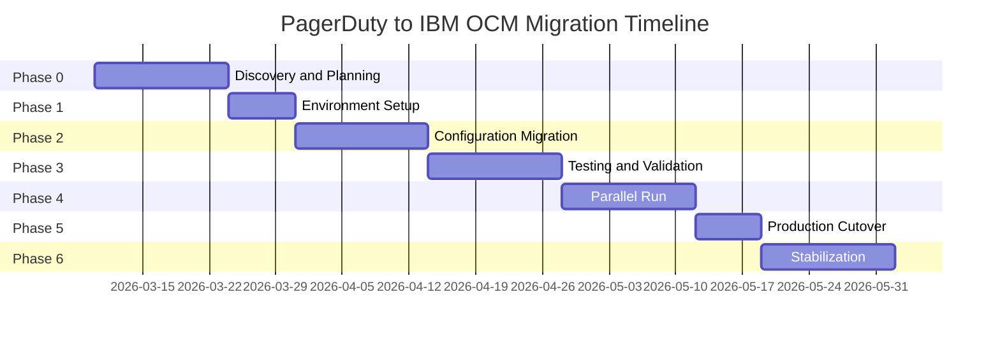

# PagerDuty to IBM On Call Manager (OCM) Migration Plan
## VPC Storage SRE Team

**Document Version:** 1.0  
**Last Updated:** March 10, 2026  
**Owner:** SRE Manager, VPC Storage SRE Team

---

## Executive Summary

This document outlines the comprehensive migration plan for transitioning the VPC Storage SRE team from PagerDuty to IBM On Call Manager (OCM). The migration will be executed in a phased approach to minimize risk and ensure business continuity for 24/7 support operations.

**Current State:**
- PagerDuty Schedule: https://ibm.pagerduty.com/schedules/PBL54OA
- Associated teams, escalation policies, and integrations
- 24/7 support model

**Target State:**
- IBM OCM Test Instance: https://oncallmanager.ibm.com/
- IBM OCM Production Instance (post-testing)
- Full feature parity with current PagerDuty setup

---

## Table of Contents

1. [Migration Objectives](#migration-objectives)
2. [Migration Phases](#migration-phases)
3. [Detailed Process Steps](#detailed-process-steps)
4. [Timeline and Milestones](#timeline-and-milestones)
5. [Risks and Mitigation Strategies](#risks-and-mitigation-strategies)
6. [Dependencies](#dependencies)
7. [Roles and Responsibilities](#roles-and-responsibilities)
8. [Testing and Validation](#testing-and-validation)
9. [Rollback Plan](#rollback-plan)
10. [Success Criteria](#success-criteria)
11. [Appendices](#appendices)

---

## Migration Objectives

### Primary Objectives
1. **Zero Downtime**: Ensure continuous 24/7 on-call coverage throughout migration
2. **Feature Parity**: Replicate all current PagerDuty functionality in IBM OCM
3. **Data Integrity**: Accurately migrate schedules, escalation policies, and team configurations
4. **Integration Continuity**: Maintain all critical monitoring and alerting integrations
5. **Team Readiness**: Ensure all team members are trained and comfortable with IBM OCM

### Success Metrics
- 100% schedule coverage maintained during migration
- Zero missed critical alerts during transition
- All team members successfully onboarded to IBM OCM
- All integrations functioning correctly
- Rollback capability maintained until production cutover

---

## Migration Phases

### Phase 0: Discovery and Planning (Week 1-2)
**Objective:** Gather comprehensive information and finalize migration strategy

**Activities:**
1. Document current PagerDuty configuration
2. Inventory all integrations and dependencies
3. Assess IBM OCM capabilities and feature mapping
4. Identify gaps and workarounds
5. Finalize migration timeline
6. Obtain stakeholder approvals

**Deliverables:**
- Current state documentation
- Integration inventory
- Feature comparison matrix
- Detailed migration plan (this document)
- Risk assessment
- Stakeholder sign-off

---

### Phase 1: Environment Setup and Access (Week 2-3)
**Objective:** Prepare IBM OCM test environment and establish access

**Activities:**
1. Provision IBM OCM test instance access for all team members
2. Configure authentication and SSO integration
3. Set up administrative roles and permissions
4. Establish connectivity to monitoring tools
5. Create test user accounts
6. Document IBM OCM navigation and features

**Deliverables:**
- IBM OCM test environment ready
- All team members have access
- Access control matrix documented
- Initial configuration guide

**Dependencies:**
- IBM OCM test instance availability
- IBM SSO/authentication setup
- Network connectivity to monitoring systems

---

### Phase 2: Configuration Migration (Week 3-5)
**Objective:** Replicate PagerDuty configuration in IBM OCM test environment

#### 2.1 Team Setup
**Activities:**
1. Create VPC Storage SRE team in IBM OCM
2. Add all team members with correct contact information
3. Configure notification preferences (email, SMS, phone, mobile app)
4. Set up user profiles and time zones
5. Validate contact information accuracy

**Validation:**
- All team members visible in IBM OCM
- Contact details match PagerDuty
- Test notifications sent successfully

#### 2.2 Schedule Migration
**Activities:**
1. Export current PagerDuty schedule (PBL54OA)
2. Analyze rotation pattern and coverage requirements
3. Create equivalent schedule in IBM OCM
4. Configure rotation rules and handoff times
5. Set up override and time-off mechanisms
6. Validate schedule coverage for next 3 months

**Validation:**
- Schedule matches PagerDuty rotation
- No coverage gaps identified
- Override functionality works correctly
- Time-off requests process properly

#### 2.3 Escalation Policy Configuration
**Activities:**
1. Document current PagerDuty escalation policy
2. Map escalation levels and timeframes
3. Create equivalent escalation policy in IBM OCM
4. Configure escalation rules and conditions
5. Set up notification channels per escalation level
6. Test escalation flow

**Validation:**
- Escalation levels match PagerDuty
- Timeframes configured correctly
- Notification channels verified
- End-to-end escalation test successful

#### 2.4 Integration Setup
**Activities:**
1. Identify all current PagerDuty integrations
2. Document integration types and configurations
3. Configure equivalent integrations in IBM OCM
4. Set up webhook endpoints and API keys
5. Configure alert routing rules
6. Test each integration individually

**Common Integrations to Migrate:**
- Monitoring tools (Prometheus, Grafana, Nagios, etc.)
- ITSM systems (ServiceNow, Jira, etc.)
- Communication platforms (Slack, Microsoft Teams)
- Email and SMS gateways
- Custom webhooks and API integrations

**Validation:**
- Each integration sends test alerts successfully
- Alert routing works correctly
- Alert formatting is appropriate
- Integration authentication verified

**Deliverables:**
- IBM OCM fully configured in test environment
- Configuration documentation
- Integration test results
- Schedule validation report

**Dependencies:**
- Access to PagerDuty configuration details
- Integration endpoint URLs and credentials
- Monitoring system access for testing

---

### Phase 3: Testing and Validation (Week 5-7)
**Objective:** Thoroughly test IBM OCM configuration and validate functionality

#### 3.1 Unit Testing
**Test Scenarios:**
1. **Schedule Testing**
   - Verify current on-call person matches expected
   - Test schedule overrides
   - Validate time-off handling
   - Check rotation handoffs
   - Test holiday schedules

2. **Notification Testing**
   - Test email notifications
   - Test SMS notifications
   - Test phone call notifications
   - Test mobile app push notifications
   - Verify notification delivery times

3. **Escalation Testing**
   - Trigger test alerts
   - Verify escalation timing
   - Test acknowledgment flow
   - Validate escalation to each level
   - Test manual escalation

4. **Integration Testing**
   - Send test alerts from each monitoring tool
   - Verify alert receipt in IBM OCM
   - Test alert acknowledgment back to source
   - Validate alert resolution flow
   - Test integration failure handling

#### 3.2 End-to-End Testing
**Test Scenarios:**
1. **Normal Alert Flow**
   - Monitoring tool generates alert
   - Alert received in IBM OCM
   - On-call person notified
   - Alert acknowledged
   - Issue resolved
   - Alert closed

2. **Escalation Flow**
   - Alert not acknowledged within timeframe
   - Escalation to next level
   - Secondary on-call notified
   - Alert acknowledged at escalation level
   - Resolution and closure

3. **High-Volume Testing**
   - Multiple simultaneous alerts
   - Alert grouping and deduplication
   - Priority handling
   - System performance under load

4. **Failure Scenarios**
   - Integration failure handling
   - Notification delivery failure
   - Network connectivity issues
   - Fallback mechanisms

#### 3.3 User Acceptance Testing (UAT)
**Activities:**
1. Conduct training sessions for all team members
2. Provide hands-on practice with IBM OCM
3. Have each team member test their notifications
4. Gather feedback on usability and functionality
5. Document issues and concerns
6. Make necessary adjustments

**Deliverables:**
- Test plan and test cases
- Test execution results
- Issue log and resolutions
- UAT sign-off from team members
- Training materials

**Dependencies:**
- Test environment stability
- Team member availability for testing
- Access to monitoring systems for test alerts

---

### Phase 4: Parallel Run (Week 7-9)
**Objective:** Run both PagerDuty and IBM OCM simultaneously to validate production readiness

**Activities:**
1. Configure IBM OCM production instance
2. Replicate test environment configuration to production
3. Set up dual alerting (PagerDuty + IBM OCM)
4. Monitor both systems for consistency
5. Compare alert delivery and timing
6. Track and resolve any discrepancies
7. Conduct daily reviews with team
8. Document lessons learned

**Parallel Run Monitoring:**
- Alert volume comparison
- Notification delivery times
- Escalation accuracy
- Integration reliability
- User experience feedback
- System performance metrics

**Duration:** 1-2 weeks (adjustable based on confidence level)

**Go/No-Go Decision Criteria:**
- 99%+ alert delivery parity between systems
- Zero critical issues in IBM OCM
- All team members comfortable with IBM OCM
- All integrations functioning correctly
- Stakeholder approval obtained

**Deliverables:**
- Parallel run report
- Discrepancy analysis
- Performance comparison
- Go/No-Go decision documentation

**Dependencies:**
- IBM OCM production instance ready
- Dual alerting configuration possible
- Team availability for monitoring

---

### Phase 5: Production Cutover (Week 9-10)
**Objective:** Transition fully to IBM OCM and decommission PagerDuty

#### 5.1 Pre-Cutover Activities (Week 9)
**Activities:**
1. Final configuration review
2. Backup all PagerDuty data
3. Verify IBM OCM production readiness
4. Communicate cutover plan to stakeholders
5. Schedule cutover window
6. Prepare rollback procedures
7. Conduct final team briefing

**Cutover Checklist:**
- [ ] All configurations verified in IBM OCM production
- [ ] All team members trained and ready
- [ ] All integrations tested in production
- [ ] Rollback plan documented and ready
- [ ] Stakeholders notified of cutover schedule
- [ ] Support resources available during cutover
- [ ] Communication plan activated

#### 5.2 Cutover Execution (Week 10)
**Recommended Cutover Window:** Low-activity period (e.g., weekend or off-peak hours)

**Cutover Steps:**
1. **T-1 hour: Pre-cutover verification**
   - Verify IBM OCM production status
   - Confirm team readiness
   - Check integration connectivity
   - Review rollback procedures

2. **T-0: Begin cutover**
   - Announce cutover start to team
   - Disable PagerDuty integrations (keep schedule active)
   - Enable IBM OCM integrations
   - Verify first alerts received in IBM OCM

3. **T+15 min: Initial validation**
   - Confirm alerts flowing to IBM OCM
   - Verify notifications being sent
   - Check on-call schedule accuracy
   - Test acknowledgment flow

4. **T+30 min: Extended validation**
   - Monitor alert volume and patterns
   - Verify all integrations active
   - Confirm escalation policies working
   - Check team member access

5. **T+1 hour: Stabilization**
   - Continue monitoring for issues
   - Address any immediate problems
   - Maintain PagerDuty as backup (read-only)

6. **T+4 hours: Cutover complete**
   - Declare cutover successful (if no issues)
   - Maintain heightened monitoring for 24 hours
   - Keep PagerDuty available for emergency rollback

#### 5.3 Post-Cutover Activities
**Activities:**
1. Monitor IBM OCM for 48 hours intensively
2. Conduct daily team check-ins for first week
3. Address any issues or concerns promptly
4. Gather feedback from team members
5. Document lessons learned
6. Update runbooks and documentation

**Deliverables:**
- Cutover execution report
- Post-cutover monitoring results
- Issue resolution log
- Updated documentation
- Lessons learned document

**Dependencies:**
- Stakeholder approval for cutover
- Team availability during cutover window
- Support resources on standby

---

### Phase 6: Stabilization and Optimization (Week 10-12)
**Objective:** Ensure stable operations and optimize IBM OCM usage

**Activities:**
1. Continue monitoring IBM OCM performance
2. Fine-tune alert routing and escalation rules
3. Optimize notification preferences
4. Address any usability issues
5. Conduct retrospective with team
6. Update procedures and documentation
7. Provide additional training if needed
8. Decommission PagerDuty (after 2-4 weeks of stable operation)

**Deliverables:**
- Optimization recommendations
- Updated documentation
- Retrospective report
- PagerDuty decommission plan

---

## Timeline and Milestones

### High-Level Timeline (10-12 weeks)



### Key Milestones

| Milestone | Target Week | Description |
|-----------|-------------|-------------|
| M1: Planning Complete | Week 2 | Migration plan approved, resources allocated |
| M2: Test Environment Ready | Week 3 | IBM OCM test instance configured and accessible |
| M3: Configuration Complete | Week 5 | All PagerDuty configs replicated in IBM OCM |
| M4: Testing Complete | Week 7 | All tests passed, UAT sign-off obtained |
| M5: Parallel Run Start | Week 7 | Both systems running simultaneously |
| M6: Go/No-Go Decision | Week 9 | Decision made to proceed with cutover |
| M7: Production Cutover | Week 10 | Live on IBM OCM, PagerDuty on standby |
| M8: PagerDuty Decommission | Week 12 | PagerDuty fully decommissioned |

### Critical Path Items
1. IBM OCM instance provisioning and access
2. Integration endpoint configuration
3. Parallel run validation
4. Go/No-Go decision approval
5. Production cutover execution

---

## Risks and Mitigation Strategies

### High-Priority Risks

#### Risk 1: Missed Critical Alerts During Migration
**Impact:** High | **Probability:** Medium

**Description:** Critical production alerts could be missed during configuration changes or cutover, leading to service outages.

**Mitigation Strategies:**
- Maintain PagerDuty active until IBM OCM fully validated
- Implement dual alerting during parallel run phase
- Schedule cutover during low-activity periods
- Have rollback plan ready for immediate execution
- Maintain 24/7 monitoring during cutover window
- Test alert flow extensively before cutover

**Contingency Plan:**
- Immediate rollback to PagerDuty if alerts not received
- Manual notification process as backup
- Escalation to management for critical issues

---

#### Risk 2: Integration Compatibility Issues
**Impact:** High | **Probability:** Medium

**Description:** Some monitoring tools may not integrate seamlessly with IBM OCM, causing alert delivery failures.

**Mitigation Strategies:**
- Conduct thorough integration testing in test environment
- Identify alternative integration methods (webhooks, email, API)
- Work with IBM OCM support for custom integrations
- Document workarounds for problematic integrations
- Test each integration individually before parallel run
- Maintain integration inventory with fallback options

**Contingency Plan:**
- Use email-based alerting as fallback
- Implement custom webhook solutions
- Engage IBM support for urgent integration issues
- Temporarily maintain PagerDuty for problematic integrations

---

#### Risk 3: Schedule Configuration Errors
**Impact:** High | **Probability:** Low

**Description:** Incorrect schedule configuration could result in wrong person being on-call or coverage gaps.

**Mitigation Strategies:**
- Triple-check schedule configuration against PagerDuty
- Validate schedule for next 3 months before cutover
- Have team members verify their on-call slots
- Test override and time-off functionality thoroughly
- Maintain schedule documentation for reference
- Conduct schedule dry-run before parallel run

**Contingency Plan:**
- Manual schedule management during issue resolution
- Quick schedule reconfiguration procedures
- Communication protocol for schedule discrepancies
- Rollback to PagerDuty schedule if needed

---

#### Risk 4: Team Adoption and Training Gaps
**Impact:** Medium | **Probability:** Medium

**Description:** Team members may struggle with IBM OCM interface or miss notifications due to unfamiliarity.

**Mitigation Strategies:**
- Conduct comprehensive training sessions
- Provide hands-on practice in test environment
- Create quick reference guides and documentation
- Assign IBM OCM champions within team
- Offer one-on-one support for struggling team members
- Maintain open feedback channel during transition

**Contingency Plan:**
- Additional training sessions as needed
- Temporary buddy system for on-call shifts
- Extended parallel run period if needed
- Simplified initial configuration for easier adoption

---

#### Risk 5: Data Loss or Configuration Corruption
**Impact:** High | **Probability:** Low

**Description:** Configuration data could be lost or corrupted during migration or cutover.

**Mitigation Strategies:**
- Backup all PagerDuty configuration before migration
- Document all IBM OCM configurations
- Use version control for configuration files where possible
- Take snapshots before major configuration changes
- Maintain configuration audit trail
- Test restore procedures

**Contingency Plan:**
- Restore from backup configurations
- Rebuild configurations from documentation
- Rollback to PagerDuty if IBM OCM data corrupted
- Engage IBM support for data recovery

---

#### Risk 6: Notification Delivery Failures
**Impact:** High | **Probability:** Low

**Description:** SMS, email, or phone notifications may fail to reach on-call personnel.

**Mitigation Strategies:**
- Test all notification channels for each team member
- Configure multiple notification methods per person
- Verify contact information accuracy
- Test notification delivery during different times
- Monitor notification delivery metrics
- Set up notification delivery alerts

**Contingency Plan:**
- Use alternative notification channels
- Manual phone tree activation
- Escalate immediately if notifications failing
- Rollback to PagerDuty if persistent issues

---

#### Risk 7: Performance Issues Under Load
**Impact:** Medium | **Probability:** Low

**Description:** IBM OCM may experience performance degradation during high alert volumes.

**Mitigation Strategies:**
- Conduct load testing before production cutover
- Monitor system performance metrics
- Configure alert grouping and deduplication
- Work with IBM on capacity planning
- Establish performance baselines
- Set up performance monitoring alerts

**Contingency Plan:**
- Implement alert throttling if needed
- Prioritize critical alerts
- Scale IBM OCM resources if possible
- Temporary rollback to PagerDuty during incidents

---

#### Risk 8: Timezone and Scheduling Conflicts
**Impact:** Medium | **Probability:** Medium

**Description:** Timezone handling differences between PagerDuty and IBM OCM could cause scheduling errors.

**Mitigation Strategies:**
- Verify timezone settings for all team members
- Test schedule across different timezones
- Document timezone handling in IBM OCM
- Validate handoff times carefully
- Test daylight saving time transitions
- Create timezone reference guide

**Contingency Plan:**
- Manual schedule adjustments as needed
- Clear communication of on-call times
- Temporary manual handoff coordination
- Quick schedule reconfiguration procedures

---

### Medium-Priority Risks

#### Risk 9: Escalation Policy Gaps
**Impact:** Medium | **Probability:** Low

**Mitigation:** Thoroughly test escalation flows, document escalation paths, validate timeframes

#### Risk 10: Mobile App Issues
**Impact:** Medium | **Probability:** Medium

**Mitigation:** Test mobile app on various devices, provide alternative notification methods, document mobile app setup

#### Risk 11: Reporting and Analytics Loss
**Impact:** Low | **Probability:** Medium

**Mitigation:** Export historical data from PagerDuty, identify equivalent reports in IBM OCM, create custom reports if needed

#### Risk 12: Stakeholder Communication Gaps
**Impact:** Medium | **Probability:** Low

**Mitigation:** Regular status updates, clear communication plan, stakeholder engagement throughout migration

---

## Dependencies

### Technical Dependencies

#### IBM OCM Platform
- **Dependency:** IBM OCM test and production instances available and accessible
- **Owner:** IBM OCM Platform Team
- **Required By:** Phase 1 (Week 2)
- **Status:** To be confirmed
- **Risk:** High - Blocks entire migration if not available

#### Authentication and SSO
- **Dependency:** IBM SSO integration configured for IBM OCM
- **Owner:** IBM Identity Management Team
- **Required By:** Phase 1 (Week 2)
- **Status:** To be confirmed
- **Risk:** High - Blocks user access

#### Network Connectivity
- **Dependency:** Network connectivity between monitoring tools and IBM OCM
- **Owner:** Network Operations Team
- **Required By:** Phase 2 (Week 3)
- **Status:** To be confirmed
- **Risk:** High - Blocks integration setup

#### Integration Endpoints
- **Dependency:** Webhook endpoints and API access for all monitoring tools
- **Owner:** Monitoring Tool Administrators
- **Required By:** Phase 2 (Week 4)
- **Status:** To be confirmed
- **Risk:** High - Blocks integration testing

#### Mobile App Access
- **Dependency:** IBM OCM mobile app available for iOS and Android
- **Owner:** IBM OCM Platform Team
- **Required By:** Phase 3 (Week 5)
- **Status:** To be confirmed
- **Risk:** Medium - Impacts notification testing

---

### Organizational Dependencies

#### Team Availability
- **Dependency:** VPC Storage SRE team members available for training and testing
- **Owner:** SRE Manager
- **Required By:** Phase 3 (Week 5)
- **Status:** To be coordinated
- **Risk:** Medium - Impacts testing timeline

#### Stakeholder Approvals
- **Dependency:** Management approval for migration plan and cutover
- **Owner:** SRE Manager / Leadership
- **Required By:** Phase 0 (Week 2) and Phase 5 (Week 9)
- **Status:** Pending
- **Risk:** Medium - Could delay cutover

#### Support Resources
- **Dependency:** IBM OCM support team available during cutover
- **Owner:** IBM Support
- **Required By:** Phase 5 (Week 10)
- **Status:** To be scheduled
- **Risk:** Medium - Impacts issue resolution

#### Change Management Approval
- **Dependency:** Change approval for production cutover
- **Owner:** Change Advisory Board
- **Required By:** Phase 5 (Week 9)
- **Status:** To be submitted
- **Risk:** Medium - Could delay cutover

---

### Data Dependencies

#### PagerDuty Configuration Export
- **Dependency:** Complete export of PagerDuty schedules, escalation policies, and integrations
- **Owner:** SRE Manager
- **Required By:** Phase 2 (Week 3)
- **Status:** To be completed
- **Risk:** Medium - Impacts configuration accuracy

#### Contact Information Verification
- **Dependency:** Verified contact information for all team members
- **Owner:** Team Members
- **Required By:** Phase 2 (Week 3)
- **Status:** To be collected
- **Risk:** Low - Impacts notification testing

#### Historical Data Archive
- **Dependency:** Archive of PagerDuty historical data for reference
- **Owner:** SRE Manager
- **Required By:** Phase 6 (Week 12)
- **Status:** To be completed
- **Risk:** Low - For historical reference only

---

## Roles and Responsibilities

### RACI Matrix

| Activity | SRE Manager | Team Members | IBM OCM Support | Monitoring Admins | Stakeholders |
|----------|-------------|--------------|-----------------|-------------------|--------------|
| Migration Planning | R/A | C | C | I | I |
| Environment Setup | A | I | R | C | I |
| Configuration Migration | R/A | C | C | C | I |
| Integration Setup | A | C | C | R | I |
| Testing Execution | A | R | C | C | I |
| Training Delivery | R/A | R | C | I | I |
| Parallel Run Monitoring | R/A | R | C | I | I |
| Go/No-Go Decision | A | C | C | I | R |
| Cutover Execution | R/A | R | C | C | I |
| Issue Resolution | R/A | C | C | C | I |
| Documentation | R/A | C | C | I | I |

**Legend:**
- R = Responsible (does the work)
- A = Accountable (final authority)
- C = Consulted (provides input)
- I = Informed (kept updated)

---

### Role Descriptions

#### SRE Manager (Migration Lead)
**Responsibilities:**
- Overall migration planning and execution
- Stakeholder communication and reporting
- Risk management and issue escalation
- Resource allocation and coordination
- Go/No-Go decision making
- Budget and timeline management

**Time Commitment:** 50% during planning, 75% during execution

---

#### Team Members (On-Call Engineers)
**Responsibilities:**
- Participate in training sessions
- Test IBM OCM functionality
- Provide feedback on usability
- Validate schedule and notification configurations
- Participate in parallel run monitoring
- Support cutover execution

**Time Commitment:** 10-20% throughout migration

---

#### IBM OCM Support Team
**Responsibilities:**
- Provide technical guidance on IBM OCM
- Assist with configuration and integration setup
- Troubleshoot technical issues
- Support cutover execution
- Provide escalation support

**Time Commitment:** On-demand support throughout migration

---

#### Monitoring Tool Administrators
**Responsibilities:**
- Provide integration endpoints and credentials
- Assist with integration configuration
- Test alert delivery from monitoring tools
- Support integration troubleshooting

**Time Commitment:** 5-10% during integration setup

---

#### Stakeholders (Leadership/Management)
**Responsibilities:**
- Approve migration plan and timeline
- Provide resources and budget
- Make Go/No-Go decisions
- Receive status updates
- Support escalation resolution

**Time Commitment:** Minimal, primarily for approvals and updates

---

## Testing and Validation

### Test Strategy

#### Test Levels
1. **Unit Testing:** Individual component testing (schedules, notifications, integrations)
2. **Integration Testing:** End-to-end alert flow testing
3. **System Testing:** Full system functionality under various scenarios
4. **User Acceptance Testing:** Team member validation and sign-off
5. **Performance Testing:** Load and stress testing
6. **Security Testing:** Authentication and authorization validation

---

### Detailed Test Plan

#### Test Phase 1: Component Testing (Week 5)

**Schedule Testing**
| Test Case | Description | Expected Result | Priority |
|-----------|-------------|-----------------|----------|
| TC-SCH-001 | Verify current on-call person | Correct person shown as on-call | High |
| TC-SCH-002 | Test schedule override | Override applied successfully | High |
| TC-SCH-003 | Validate rotation handoff | Handoff occurs at correct time | High |
| TC-SCH-004 | Test time-off request | Time-off reflected in schedule | Medium |
| TC-SCH-005 | Verify holiday schedule | Holiday coverage configured | Medium |
| TC-SCH-006 | Test schedule for 3 months | No gaps in coverage | High |

**Notification Testing**
| Test Case | Description | Expected Result | Priority |
|-----------|-------------|-----------------|----------|
| TC-NOT-001 | Email notification delivery | Email received within 1 minute | High |
| TC-NOT-002 | SMS notification delivery | SMS received within 1 minute | High |
| TC-NOT-003 | Phone call notification | Call received within 2 minutes | High |
| TC-NOT-004 | Mobile app push notification | Push received within 30 seconds | High |
| TC-NOT-005 | Multiple notification channels | All channels receive notification | Medium |
| TC-NOT-006 | Notification retry on failure | Retry attempted per configuration | Medium |

**Escalation Testing**
| Test Case | Description | Expected Result | Priority |
|-----------|-------------|-----------------|----------|
| TC-ESC-001 | Level 1 escalation timing | Escalates after configured time | High |
| TC-ESC-002 | Level 2 escalation timing | Escalates to level 2 correctly | High |
| TC-ESC-003 | Level 3 escalation timing | Escalates to level 3 correctly | High |
| TC-ESC-004 | Acknowledgment stops escalation | No further escalation after ack | High |
| TC-ESC-005 | Manual escalation | Manual escalation works | Medium |
| TC-ESC-006 | Escalation notification | All levels notified correctly | High |

**Integration Testing**
| Test Case | Description | Expected Result | Priority |
|-----------|-------------|-----------------|----------|
| TC-INT-001 | Monitoring tool alert | Alert received in IBM OCM | High |
| TC-INT-002 | Alert acknowledgment sync | Ack synced back to source | High |
| TC-INT-003 | Alert resolution sync | Resolution synced to source | High |
| TC-INT-004 | Alert formatting | Alert details formatted correctly | Medium |
| TC-INT-005 | Integration authentication | Auth successful for all integrations | High |
| TC-INT-006 | Integration failure handling | Failure handled gracefully | Medium |

---

#### Test Phase 2: End-to-End Testing (Week 6)

**Normal Alert Flow**
1. Trigger test alert from monitoring tool
2. Verify alert received in IBM OCM within 30 seconds
3. Verify on-call person notified via all configured channels
4. Acknowledge alert in IBM OCM
5. Verify acknowledgment synced to monitoring tool
6. Resolve issue and close alert
7. Verify resolution synced to monitoring tool

**Escalation Flow**
1. Trigger test alert from monitoring tool
2. Do not acknowledge alert
3. Verify escalation to level 2 after configured time
4. Verify level 2 person notified
5. Acknowledge at level 2
6. Verify escalation stopped
7. Resolve and close alert

**High-Volume Scenario**
1. Trigger 10+ simultaneous alerts
2. Verify all alerts received
3. Verify alert grouping/deduplication works
4. Verify notifications not overwhelming
5. Verify system performance acceptable
6. Acknowledge and resolve all alerts

---

#### Test Phase 3: User Acceptance Testing (Week 6-7)

**UAT Checklist for Each Team Member:**
- [ ] Successfully log into IBM OCM
- [ ] View current on-call schedule
- [ ] Verify personal contact information
- [ ] Test email notification receipt
- [ ] Test SMS notification receipt
- [ ] Test phone call notification receipt
- [ ] Test mobile app notification receipt
- [ ] Acknowledge a test alert
- [ ] Create a schedule override
- [ ] Request time-off
- [ ] Manually escalate an alert
- [ ] View alert history
- [ ] Provide feedback on usability

**UAT Sign-off Criteria:**
- 100% of team members complete UAT checklist
- No critical usability issues reported
- All team members comfortable with IBM OCM
- Training materials adequate

---

### Performance Testing

**Load Testing Scenarios:**
1. **Normal Load:** 10-20 alerts per hour
2. **Peak Load:** 50-100 alerts per hour
3. **Stress Load:** 200+ alerts per hour

**Performance Metrics:**
- Alert ingestion time: < 5 seconds
- Notification delivery time: < 60 seconds
- System response time: < 2 seconds
- API response time: < 500ms
- Database query time: < 100ms

---

## Rollback Plan

### Rollback Triggers

**Immediate Rollback Required:**
- Critical alerts not being received in IBM OCM
- Complete system failure or unavailability
- Data corruption or loss
- Security breach or vulnerability
- Multiple integration failures

**Rollback Consideration:**
- Significant notification delivery delays (>5 minutes)
- Escalation policy not functioning
- Schedule configuration errors affecting coverage
- Performance degradation impacting operations
- Team unable to use IBM OCM effectively

---

### Rollback Procedures

#### During Parallel Run (Phase 4)
**Rollback Steps:**
1. Announce rollback decision to team
2. Disable IBM OCM integrations
3. Verify PagerDuty integrations active
4. Confirm alerts flowing to PagerDuty
5. Verify team notifications working
6. Document rollback reason
7. Schedule post-mortem

**Rollback Time:** < 15 minutes

---

#### During/After Cutover (Phase 5)
**Rollback Steps:**
1. **Immediate Actions (0-5 minutes)**
   - Announce rollback to team via multiple channels
   - Disable all IBM OCM integrations
   - Re-enable PagerDuty integrations
   - Verify PagerDuty schedule active

2. **Validation (5-15 minutes)**
   - Send test alerts to PagerDuty
   - Verify notifications being received
   - Confirm escalation policy working
   - Check team member access

3. **Stabilization (15-30 minutes)**
   - Monitor PagerDuty for issues
   - Verify all integrations functioning
   - Confirm schedule accuracy
   - Address any immediate problems

4. **Post-Rollback (30+ minutes)**
   - Conduct team debrief
   - Document rollback reason and issues
   - Analyze root cause
   - Develop remediation plan
   - Schedule retry timeline

**Rollback Time:** < 30 minutes

---

### Rollback Decision Authority

**Authorized to Initiate Rollback:**
- SRE Manager (Migration Lead)
- On-Call Team Lead
- Senior Leadership (if SRE Manager unavailable)

**Rollback Decision Process:**
1. Identify issue or trigger
2. Assess severity and impact
3. Attempt quick fix (5-10 minutes max)
4. If unresolved, initiate rollback
5. Communicate decision to all stakeholders
6. Execute rollback procedures
7. Verify rollback successful

---

### Post-Rollback Actions

**Immediate (Day 1):**
- Conduct post-mortem meeting
- Document all issues encountered
- Analyze root causes
- Identify corrective actions
- Update risk register

**Short-term (Week 1):**
- Implement fixes for identified issues
- Re-test in test environment
- Update migration plan
- Communicate revised timeline
- Obtain stakeholder approval for retry

**Long-term:**
- Address systemic issues
- Enhance testing procedures
- Update rollback procedures
- Improve monitoring and alerting
- Schedule migration retry

---

## Success Criteria

### Migration Success Criteria

**Technical Success:**
- [ ] 100% schedule coverage maintained throughout migration
- [ ] Zero missed critical alerts during transition
- [ ] All integrations functioning with 99%+ reliability
- [ ] Alert delivery time < 60 seconds
- [ ] Escalation policies working correctly
- [ ] All notification channels operational
- [ ] System performance meets SLAs

**Operational Success:**
- [ ] All team members successfully onboarded
- [ ] 100% UAT sign-off from team
- [ ] Documentation complete and accessible
- [ ] Runbooks updated for IBM OCM
- [ ] Training materials created and delivered
- [ ] Support processes established

**Business Success:**
- [ ] Zero service disruptions due to migration
- [ ] Stakeholder satisfaction achieved
- [ ] Migration completed within timeline
- [ ] Budget constraints met
- [ ] Lessons learned documented
- [ ] PagerDuty successfully decommissioned

---

### Post-Migration Metrics (30-day tracking)

**Reliability Metrics:**
- Alert delivery success rate: > 99.9%
- Notification delivery success rate: > 99.5%
- System uptime: > 99.9%
- Integration uptime: > 99.5%

**Performance Metrics:**
- Average alert ingestion time: < 5 seconds
- Average notification delivery time: < 60 seconds
- Average escalation accuracy: > 99%
- System response time: < 2 seconds

**User Satisfaction Metrics:**
- Team satisfaction score: > 4/5
- Usability rating: > 4/5
- Training effectiveness: > 4/5
- Support responsiveness: > 4/5

---

## Appendices

### Appendix A: PagerDuty Configuration Export Template

**Schedule Export:**
```
Schedule Name: [Schedule Name]
Schedule ID: [Schedule ID]
Timezone: [Timezone]
Rotation Type: [Daily/Weekly/Custom]
Rotation Start: [Date/Time]

Team Members:
- [Name] | [Email] | [Phone] | [Rotation Slot]
- [Name] | [Email] | [Phone] | [Rotation Slot]

Overrides:
- [Date] | [Time] | [Person] | [Reason]

Time-off:
- [Date Range] | [Person]
```

**Escalation Policy Export:**
```
Policy Name: [Policy Name]
Policy ID: [Policy ID]

Level 1:
- Escalation Time: [Minutes]
- Notify: [Person/Schedule]
- Notification Methods: [Email/SMS/Phone/App]

Level 2:
- Escalation Time: [Minutes]
- Notify: [Person/Schedule]
- Notification Methods: [Email/SMS/Phone/App]

Level 3:
- Escalation Time: [Minutes]
- Notify: [Person/Schedule]
- Notification Methods: [Email/SMS/Phone/App]
```

**Integration Export:**
```
Integration Name: [Name]
Integration Type: [Type]
Integration Key: [Key]
Webhook URL: [URL]
Alert Routing: [Rules]
Custom Fields: [Fields]
```

---

### Appendix B: IBM OCM Quick Reference Guide

**Accessing IBM OCM:**
- Test Instance: https://oncallmanager.ibm.com/
- Production Instance: [To be provided]
- Mobile App: IBM On Call Manager (iOS/Android)

**Common Tasks:**
1. **View Current On-Call:** Dashboard > Schedule > Current
2. **Acknowledge Alert:** Alerts > [Alert] > Acknowledge
3. **Create Override:** Schedule > Add Override > [Details]
4. **Request Time-Off:** Profile > Time Off > Request
5. **Escalate Manually:** Alert > Actions > Escalate
6. **View Alert History:** Reports > Alert History

**Support Contacts:**
- IBM OCM Support: [Contact Info]
- SRE Manager: [Contact Info]
- Team Lead: [Contact Info]

---

### Appendix C: Communication Plan

**Stakeholder Communication:**

| Audience | Frequency | Method | Content |
|----------|-----------|--------|---------|
| Team Members | Weekly | Email + Slack | Detailed progress, upcoming activities |
| SRE Manager | Daily (during cutover) | Slack + Meetings | Status, issues, decisions needed |
| Leadership | Bi-weekly | Email | High-level progress, risks, milestones |
| IBM OCM Support | As needed | Email + Tickets | Technical issues, questions |
| Change Advisory Board | Before cutover | Formal submission | Change request details |

**Communication Templates:**

**Weekly Status Update:**
```
Subject: PagerDuty to IBM OCM Migration - Week [X] Update

Current Phase: [Phase Name]
Progress: [X]% complete
Completed This Week:
- [Item 1]
- [Item 2]

Planned for Next Week:
- [Item 1]
- [Item 2]

Risks/Issues:
- [Issue 1] - [Status]

Action Items:
- [Action] - [Owner] - [Due Date]
```

**Cutover Announcement:**
```
Subject: IMPORTANT: IBM OCM Cutover - [Date/Time]

The VPC Storage SRE team will be cutting over from PagerDuty to IBM OCM on:
Date: [Date]
Time: [Time]
Duration: [Expected Duration]

What to Expect:
- [Details]

What You Need to Do:
- [Actions]

Support:
- [Contact Information]
```

---

### Appendix D: Training Materials Checklist

**Training Content:**
- [ ] IBM OCM overview presentation
- [ ] Hands-on lab guide
- [ ] Quick reference card
- [ ] Video tutorials (basic operations)
- [ ] FAQ document
- [ ] Troubleshooting guide
- [ ] Mobile app setup guide
- [ ] Integration guide for monitoring tools

**Training Sessions:**
- [ ] Initial overview session (1 hour)
- [ ] Hands-on practice session (2 hours)
- [ ] Q&A session (30 minutes)
- [ ] Refresher session before cutover (1 hour)
- [ ] One-on-one sessions (as needed)

---

### Appendix E: Lessons Learned Template

**Post-Migration Retrospective:**

**What Went Well:**
- [Item 1]
- [Item 2]

**What Could Be Improved:**
- [Item 1]
- [Item 2]

**Unexpected Challenges:**
- [Challenge 1] - [How Resolved]
- [Challenge 2] - [How Resolved]

**Recommendations for Future Migrations:**
- [Recommendation 1]
- [Recommendation 2]

**Action Items:**
- [Action] - [Owner] - [Due Date]

---

### Appendix F: Customization Notes

**This migration plan should be customized with:**

1. **Team-Specific Details:**
   - Exact team size and member names
   - Current rotation pattern (daily/weekly/follow-the-sun)
   - Specific timezone considerations
   - Team structure and reporting lines

2. **Integration Details:**
   - Complete list of monitoring tools
   - Integration types and methods
   - Webhook URLs and API endpoints
   - Authentication mechanisms

3. **Escalation Policy Details:**
   - Number of escalation levels
   - Specific timeframes for each level
   - Escalation targets (individuals/teams)
   - Special escalation rules

4. **Timeline Adjustments:**
   - Adjust phase durations based on team size
   - Account for blackout periods
   - Consider holiday schedules
   - Align with organizational change windows

5. **Risk Assessment:**
   - Add team-specific risks
   - Adjust probability/impact ratings
   - Add mitigation strategies for known issues
   - Update based on organizational risk tolerance

6. **Resource Allocation:**
   - Identify specific team members for roles
   - Allocate budget for tools/training
   - Schedule dedicated time for migration activities
   - Arrange for backup resources

---

## Document Control

**Version History:**

| Version | Date | Author | Changes |
|---------|------|--------|---------|
| 1.0 | 2026-03-10 | SRE Manager | Initial draft |

**Review and Approval:**

| Role | Name | Signature | Date |
|------|------|-----------|------|
| SRE Manager | [Name] | | |
| Team Lead | [Name] | | |
| Leadership | [Name] | | |
| IBM OCM Support | [Name] | | |

**Next Review Date:** [Date]

---

## Contact Information

**Migration Team:**
- **SRE Manager:** [Name] | [Email] | [Phone]
- **Team Lead:** [Name] | [Email] | [Phone]
- **IBM OCM Support:** [Email] | [Support Portal]

**Escalation Contacts:**
- **Level 1:** SRE Manager
- **Level 2:** Director of Engineering
- **Level 3:** VP of Operations

---

**END OF DOCUMENT**